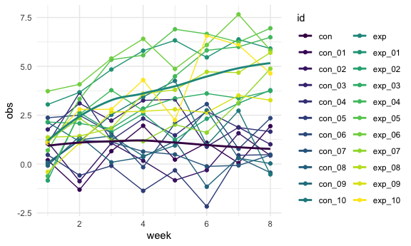
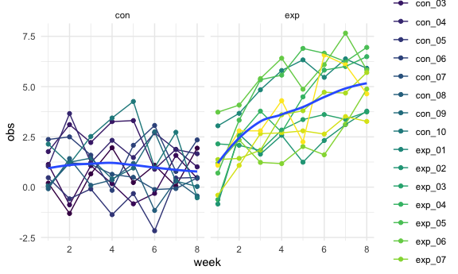
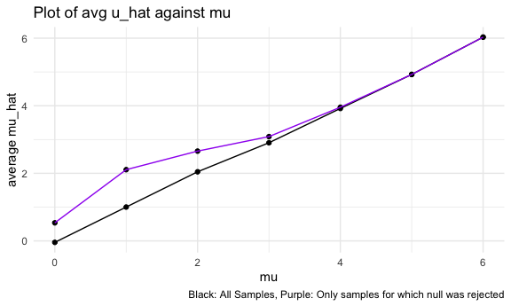

p8105_hw5_sdc2157
================
Stephanie Calluori
2023-11-15

load packages and set seed

``` r
library(tidyverse)
library(readr)
library(rvest)
library(httr)
library(patchwork)

set.seed(1)
```

# Problem 1

\#Describe the Raw data:

``` r
homicide_raw <- read_csv("data/homicide_data_copy.csv", col_names = TRUE)
```

    ## Rows: 52179 Columns: 12
    ## ── Column specification ────────────────────────────────────────────────────────
    ## Delimiter: ","
    ## chr (9): uid, victim_last, victim_first, victim_race, victim_age, victim_sex...
    ## dbl (3): reported_date, lat, lon
    ## 
    ## ℹ Use `spec()` to retrieve the full column specification for this data.
    ## ℹ Specify the column types or set `show_col_types = FALSE` to quiet this message.

``` r
#str(homicide_raw)
nrow(homicide_raw)
```

    ## [1] 52179

``` r
ncol(homicide_raw)
```

    ## [1] 12

``` r
colnames(homicide_raw)
```

    ##  [1] "uid"           "reported_date" "victim_last"   "victim_first" 
    ##  [5] "victim_race"   "victim_age"    "victim_sex"    "city"         
    ##  [9] "state"         "lat"           "lon"           "disposition"

``` r
homicide_raw |> 
  count(uid) |> 
  arrange(desc(n))
```

    ## # A tibble: 52,179 × 2
    ##    uid            n
    ##    <chr>      <int>
    ##  1 Alb-000001     1
    ##  2 Alb-000002     1
    ##  3 Alb-000003     1
    ##  4 Alb-000004     1
    ##  5 Alb-000005     1
    ##  6 Alb-000006     1
    ##  7 Alb-000007     1
    ##  8 Alb-000008     1
    ##  9 Alb-000009     1
    ## 10 Alb-000010     1
    ## # ℹ 52,169 more rows

ADD DESCRIPTION for raw data; rows, columns, variables; each row is a
case; no double entries of cases

\#Create a city_state variable (e.g. “Baltimore, MD”) and then summarize
within cities to obtain the total number of homicides and the number of
unsolved homicides (those for which the disposition is “Closed without
arrest” or “Open/No arrest”).

victim_age is of class character so we made it a numeric

``` r
homicide_clean <- homicide_raw |> 
  janitor::clean_names() |> 
  mutate(victim_age = as.numeric(victim_age)) |> 
  mutate(city_state = paste(city, state, sep = ",")) |> 
  mutate(disposition = recode(
    disposition,
    "Closed by arrest" = 0,
    "Closed without arrest" = 1,
    "Open/No arrest" = 1))
```

    ## Warning: There was 1 warning in `mutate()`.
    ## ℹ In argument: `victim_age = as.numeric(victim_age)`.
    ## Caused by warning:
    ## ! NAs introduced by coercion

``` r
head(homicide_clean)
```

    ## # A tibble: 6 × 13
    ##   uid   reported_date victim_last victim_first victim_race victim_age victim_sex
    ##   <chr>         <dbl> <chr>       <chr>        <chr>            <dbl> <chr>     
    ## 1 Alb-…      20100504 GARCIA      JUAN         Hispanic            78 Male      
    ## 2 Alb-…      20100216 MONTOYA     CAMERON      Hispanic            17 Male      
    ## 3 Alb-…      20100601 SATTERFIELD VIVIANA      White               15 Female    
    ## 4 Alb-…      20100101 MENDIOLA    CARLOS       Hispanic            32 Male      
    ## 5 Alb-…      20100102 MULA        VIVIAN       White               72 Female    
    ## 6 Alb-…      20100126 BOOK        GERALDINE    White               91 Female    
    ## # ℹ 6 more variables: city <chr>, state <chr>, lat <dbl>, lon <dbl>,
    ## #   disposition <dbl>, city_state <chr>

``` r
class(homicide_clean$victim_age)
```

    ## [1] "numeric"

``` r
homicide_clean |> 
  count(city_state) |> 
  nrow()
```

    ## [1] 51

Total number of homicides in each city

``` r
homicide_clean |> 
  count(city_state) |> 
  mutate(city_state = forcats::fct_reorder(city_state, n, .desc = TRUE)) |> 
  ggplot(aes(x = city_state, y = n)) + 
  geom_col() +
  labs(
    title = "Number of homicides in each city",
    x = "city",
    y = "Total # of homicides"
  ) +
  theme(axis.text.x = element_text(angle=90, vjust=1, hjust=1))
```


number of unsolved homicides (those for which the disposition is “Closed
without arrest” or “Open/No arrest”). Number of unresolved homicides in
each city

``` r
homicide_clean |> 
  filter(disposition == 1) |> 
  count(city_state) |> 
  mutate(city_state = forcats::fct_reorder(city_state, n, .desc = TRUE)) |> 
  ggplot(aes(x = city_state, y = n)) + 
  geom_col() +
  labs(
    title = "Number of unresolved homicides in each city",
    x = "city",
    y = "# of unresolved homicides"
  ) +
  theme(axis.text.x = element_text(angle=90, vjust=1, hjust=1))
```


DESCRIBE Each Graph

If n\> 30: prop.test(x, n, p = 0.5, alternative = “two.sided”,
correct=TRUE) For the city of Baltimore, MD, use the prop.test function
to estimate the proportion of homicides that are unsolved; save the
output of prop.test as an R object, apply the broom::tidy to this object
and pull the estimated proportion and confidence intervals from the
resulting tidy dataframe.

Conducting a one sample test for proportions using prop.test Is the
proportion of unresolved cases in Baltimore different from 50%?

``` r
baltimore_df <- homicide_clean |> 
  filter(city == "Baltimore")

num_successes <- baltimore_df |> 
  filter(disposition == 1) |> 
  nrow()

n_sample <- nrow(baltimore_df)

output <- prop.test(x = num_successes, n = n_sample, p = 0.5, alternative = "two.sided", conf.level = 0.95, correct = FALSE)

output |> 
  broom::tidy() |> 
  select(estimate, conf.low, conf.high)
```

    ## # A tibble: 1 × 3
    ##   estimate conf.low conf.high
    ##      <dbl>    <dbl>     <dbl>
    ## 1    0.646    0.628     0.663

``` r
#prop.test(x = num successes, n = total cases, p = 0.5, alternative = "two.sided", conf.level = 0.95, correct = FALSE)


#fit |> 
 # broom::tidy() |> 
  #select(term, estimate, p.value) |> 
 # mutate(term = str_replace(term, "^borough", "Borough: ")) |> 
 # knitr::kable(digits = 3)
```

Turn Baltimore example into a function to get estimate and CI for each
city; then test the function

``` r
estimate_and_CI <- function(city_df) {
  
successes <- city_df |> 
  filter(disposition == 1) |> 
  nrow()

sample_size <- nrow(city_df)

output <- prop.test(x = successes, n = sample_size, p = 0.5, alternative = "two.sided", conf.level = 0.95, correct = FALSE)

output |> 
  broom::tidy() |> 
  select(estimate, conf.low, conf.high)
  
}

estimate_and_CI(baltimore_df )
```

    ## # A tibble: 1 × 3
    ##   estimate conf.low conf.high
    ##      <dbl>    <dbl>     <dbl>
    ## 1    0.646    0.628     0.663

Now run prop.test for each of the cities in your dataset, and extract
both the proportion of unsolved homicides and the confidence interval
for each. Do this within a “tidy” pipeline, making use of purrr::map,
purrr::map2, list columns and unnest as necessary to create a tidy
dataframe with estimated proportions and CIs for each city.

``` r
homicide_nest_df <- homicide_clean |> 
  select(city, everything()) |> 
  nest(.data = _, data = uid:city_state)

results <- homicide_nest_df |> 
  mutate(summary = map(data, estimate_and_CI)) |> 
  unnest(cols = summary) |> 
  select(city, estimate, conf.low, conf.high)

head(results)
```

    ## # A tibble: 6 × 4
    ##   city        estimate conf.low conf.high
    ##   <chr>          <dbl>    <dbl>     <dbl>
    ## 1 Albuquerque    0.386    0.339     0.436
    ## 2 Atlanta        0.383    0.353     0.414
    ## 3 Baltimore      0.646    0.628     0.663
    ## 4 Baton Rouge    0.462    0.415     0.510
    ## 5 Birmingham     0.434    0.400     0.468
    ## 6 Boston         0.505    0.465     0.544

``` r
#map(homicide_nest_df$data, estimate_and_CI)
```

Create a plot that shows the estimates and CIs for each city – check out
geom_errorbar for a way to add error bars based on the upper and lower
limits. Organize cities according to the proportion of unsolved
homicides.

``` r
results |> 
  mutate(city = forcats::fct_reorder(city, estimate, .desc = TRUE)) |> 
  ggplot(aes(x = city, y = estimate)) +
  geom_point() +
  geom_errorbar(
    aes(x = city,
        ymin = conf.low,
        ymax = conf.high)
  ) +
  labs(
    title = "Estimate of the proportion of unresolved homicides in each city",
    x = "city",
    y = "estimate of proportion of unresolved homicides"
  ) +
  theme(axis.text.x = element_text(angle=90, vjust=1, hjust=1))
```


# Problem 2

Start with a dataframe containing all file names; the list.files
function will help Iterate over file names and read in data for each
subject using purrr::map and saving the result as a new variable in the
dataframe

Tidy the result; manipulate file names to include control arm and
subject ID, make sure weekly observations are “tidy”, and do any other
tidying that’s necessary

Make a spaghetti plot showing observations on each subject over time,
and comment on differences between groups.

``` r
participant_list <- list.files("data/rct_data", full.names = TRUE)

participant_df <- participant_df <- tibble(file_name = participant_list) |> 
  mutate(all_obs = (map(file_name, \(f) read_csv(file = f)))) 

participant_clean <- participant_df |> 
  unnest(all_obs) |> 
  pivot_longer(
    week_1:week_8,
    names_to = "week",
    values_to = "obs",
    names_prefix = "week_") |> 
  mutate(file_name = map(file_name, \(g) basename(g))) |> 
  unnest(file_name) |> 
  mutate(file_name = stringr::str_remove(file_name, ".csv")) |> 
  rename(id = file_name) |> 
  mutate(week = as.numeric(week)) |> 
  mutate(arm = stringr::str_sub(id, 1, 3)) |> 
  select(id, arm, week, obs)
```

Which plot to use?

``` r
participant_clean |> 
  ggplot(aes(x = week, y = obs)) +
  geom_point(aes(color = id)) +
  geom_line(aes(color = id)) +
  geom_smooth(aes(color = arm), se = FALSE) 
```

    ## `geom_smooth()` using method = 'loess' and formula = 'y ~ x'



``` r
participant_clean |> 
  ggplot(aes(x = week, y = obs)) +
  geom_point(aes(color = id)) +
  geom_line(aes(color = id)) +
  geom_smooth(se = FALSE) +
  facet_grid(~arm)
```

    ## `geom_smooth()` using method = 'loess' and formula = 'y ~ x'



# Problem 3

One sample t test; two sided \*Change to 5000 runs; what to do about
computer pausing when running? won’t give next output

``` r
t_test <- function(x) {
  t = t.test(x = x, mu = 0, conf.level = 0.95)
  
  broom::tidy(t)
}

simul_df <- 
  expand_grid(
    sample_size = 30,
    true_mean_u = 0:6,
    iter = 1:5000
  ) |> 
  mutate(simul_dataset = map2(sample_size, true_mean_u, \(sa, tmu) rnorm(n = sa, mean = tmu, sd = 5)))

simul_df <- simul_df |> 
  mutate(summary = map(simul_dataset, \(si) t_test(x = si))) |> 
  unnest(summary) |> 
  select(true_mean_u, estimate, p.value)
```

Make a plot showing the proportion of times the null was rejected (the
power of the test) on the y axis and the true value of μ on the x axis.
Describe the association between effect size and power.

``` r
simul_df |> 
  select(true_mean_u, estimate, p.value) |> 
  mutate(null_rejected = case_when(
    p.value <= 0.05 ~ "Yes",
    p.value > 0.05 ~ "No")) |>
  group_by(true_mean_u) |>
  count(null_rejected) |> 
  mutate(prop = n / sum(n)*100) |> 
  filter(null_rejected == "Yes") |> 
  ggplot(aes(x = true_mean_u, y = prop)) +
  geom_point() +
  labs(
    title = "Plot of power against mu",
    x = "mu",
    y = "power"
  )
```



As effect size increases, power increases.

Make a plot showing the average estimate of μ̂ on the y axis and the true
value of μ on the x axis. Make a second plot (or overlay on the first)
the average estimate of μ̂ only in samples for which the null was
rejected on the y axis and the true value of μ on the x axis. Is the
sample average of μ̂ across tests for which the null is rejected
approximately equal to the true value of μ ? Why or why not?

``` r
all <- simul_df |> 
  select(true_mean_u, estimate) |> 
  group_by(true_mean_u) |> 
  summarize(avg_estimate_u = mean(estimate)) |> 
  ggplot(aes(true_mean_u, avg_estimate_u)) +
  geom_point() +
  geom_smooth(se = FALSE) +
  labs(
    title = "Plot of avg u_hat against mu",
    x = "mu",
    y = "average mu_hat"
  )

filtered <- simul_df |> 
  select(true_mean_u, estimate, p.value) |> 
  filter(p.value <= 0.05) |> 
  group_by(true_mean_u) |> 
  summarize(avg_estimate_u = mean(estimate)) |> 
  ggplot(aes(true_mean_u, avg_estimate_u)) +
  geom_point() +
  geom_smooth(se = FALSE) +
  labs(
    title = "Plot of avg u_hat against mu",
    subtitle = "Only when null hypotesis is rejected",
    x = "mu",
    y = "average mu_hat"
  )

all + filtered
```

    ## `geom_smooth()` using method = 'loess' and formula = 'y ~ x'
    ## `geom_smooth()` using method = 'loess' and formula = 'y ~ x'


better fit at higher values. why? greater effect size so more power?
power - rejecting the null when it is actually false but when we reject
the null we say it follows a diff distribution so they shouldn’t match?
